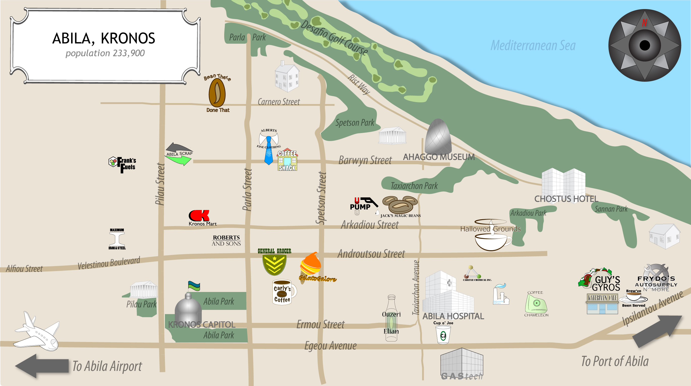

```{r setup, include=FALSE}
knitr::opts_chunk$set(echo = TRUE)
```

# Background

### VAST challenge 2021

In the roughly twenty years that Tethys-based GAStech has been operating a natural gas production site in the island country of Kronos, it has produced remarkable profits and developed strong relationships with the government of Kronos. However, GAStech has not been as successful in demonstrating environmental stewardship.

In January, 2014, the leaders of GAStech are celebrating their new-found fortune as a result of the initial public offering of their very successful company. In the midst of this celebration, several employees of GAStech go missing. An organization known as the Protectors of Kronos (POK) is suspected in the disappearance, but things may not be what they seem.

As an expert in visual analytics, you are called in to help law enforcement from Kronos and Tethys.

### Mini Challenge 2

Many of the Abila, Kronos-based employees of GAStech have company cars which are approved for both personal and business use. Those who do not have company cars have the ability to check out company trucks for business use, but these trucks cannot be used for personal business.

Employees with company cars are happy to have these vehicles, because the company cars are generally much higher quality than the cars they would be able to afford otherwise. However, GAStech does not trust their employees. Without the employees? knowledge, GAStech has installed geospatial tracking software in the company vehicles. The vehicles are tracked periodically as long as they are moving.

This vehicle tracking data has been made available to law enforcement to support their investigation. Unfortunately, data is not available for the day the GAStech employees went missing. Data is only available for the two weeks prior to the disappearance.

To promote local businesses, Kronos based companies provide a Kronos Kares benefit card to GASTech employees giving them discounts and rewards in exchange for collecting information about their credit card purchases and preferences as recorded on loyalty cards. This data has been made available to investigators in the hopes that it can help resolve the situation. However, Kronos Kares does not collect personal information beyond purchases.

As a visual analytics expert assisting law enforcement, your mission is to identify which GASTech employees made which purchases and identify suspicious patterns of behavior. You must cope with uncertainties that result from missing, conflicting, and imperfect data to make recommendations for further investigation.

#### Questions

* Using just the credit and loyalty card data, identify the most popular locations, and when they are popular. What anomalies do you see? What corrections would you recommend to correct these anomalies? Please limit your answer to 8 images and 300 words.

* Add the vehicle data to your analysis of the credit and loyalty card data. How does your assessment of the anomalies in question 1 change based on this new data? What discrepancies between vehicle, credit, and loyalty card data do you find? Please limit your answer to 8 images and 500 words.

* Can you infer the owners of each credit card and loyalty card? What is your evidence? Where are there uncertainties in your method? Where are there uncertainties in the data? Please limit your answer to 8 images and 500 words.

* Given the data sources provided, identify potential informal or unofficial relationships among GASTech personnel. Provide evidence for these relationships. Please limit your response to 8 images and 500 words.

* Do you see evidence of suspicious activity? Identify 1- 10 locations where you believe the suspicious activity is occurring, and why Please limit your response to 10 images and 500 words.

* If you solved this mini-challenge in 2014, how did you approach it differently this year?

More details and other Mini chanllenges please refer to the official website: [VAST Challenge 2021](https://vast-challenge.github.io/2021/).

# Literature review

We read some products of VAST Challenge 2014 since that challenge has the same theme of VAST Challenge 2021. The works are listed at the [Visual Analytics Benchmark Repository](http://visualdata.wustl.edu/varepository/VAST%20Challenge%202014/challenges/MC2%20-%20Patterns%20of%20Life%20Analysis/).

### PeKing University: Excellent Comprehensive Visual Analysis System

Please refer to the original work website [PeKing University](http://visualdata.wustl.edu/varepository/VAST%20Challenge%202014/challenges/MC2%20-%20Patterns%20of%20Life%20Analysis/entries/Peking%20University/) for the entire work.


From the above visualizations, we can see that:

* Heatmap is useful for analyzing the population of the locations. The color can represent the number of transactions happened in the specific location, the more the transactions, the more popular the location is.

* Weekdays and weekends may have different patterns. People need to work and go to the company at weekdays, while they usually arrange the shopping or other entertainment in weekends. If we do not take this into consideration, some of the anomalias cannot be found.


* It is more straightforward to display the car tracking data into the map. Also, we need to notice that different time period (weekdays or weekends) have different traffic patterns.


* It is more reasonable to consider time when analyzing the gps traffic data.

* We can use datatable to help explain the result.


* We can use QGIS to operate the jpg image so that it is combined to the geospatial data. Then it is possible to plot the car tracking data to the map.

### Middlesex University: Honorable Mention: Effective Use of a Custom Tool

Please refer to the original work website [Middlesex University](http://visualdata.wustl.edu/varepository/VAST%20Challenge%202014/challenges/MC2%20-%20Patterns%20of%20Life%20Analysis/entries/Middlesex%20University/) for the entire work.


* Here are one detialed map, where include some locations that do not appear in the given tourist jpg images. We can refer to this one when needed.


* It is also a good choice to using bar plot to visualize the amount or count. But it is not good to use 3D format, it will make the figure difficult to recognize the amount.


### Central South University: Outstanding Visualization and Analysis

Please refer to the original work website [Central South University](http://visualdata.wustl.edu/varepository/VAST%20Challenge%202014/challenges/MC2%20-%20Patterns%20of%20Life%20Analysis/entries/Central%20South%20University/) for the entire work.


* We can also try to segment the car-tracking data by the different time period in a day to see the detailed tracking.

### Others

* It is necessary to check the car tracking details for every car owners in different time to get more useful insight.

* We need to take care about the abnormal activity time, especially large transaction numbers, abnormal overtime work, the arrivals to the same not normal place of different car owners...

# Data Preparation

### What we have

We have six data sources:

|File name            |Descriptions       |
|---------------------|-------------------|
|car-assignments.csv  |vehicle assignments by employee      |
|gps.csv              |vehicle tracking data                |
|loyalty_data.csv     |loyalty card transaction data        |
|cc_data.csv          |credit and debit card transaction data       |
|Geospatial folder    |ESRI shapefiles of Abila and Kronos          |
|MC2-Tourist.jpg      |A tourist map of Abila with locations of interest identified   |

tourist map is shown as follow.



### load packages

The code chunk below will check if the necessary R packages have been installed, if not, R will install the missing R packages before launching them.

```{r}
packages = c('tidyverse', 'raster', 'sf', 'tmap', 'clock', 'rgdal', 'ggiraph', 'plotly', 'DT', 'lubridate', 'grid', 'mapview', "plyr", 'dplyr')
for (p in packages){
  if(!require(p, character.only = T)){
    install.packages(p)
  }
  library(p, character.only = T)
}
```

### load data

```{r}
car_assign <- read_csv("data/car-assignments.csv")
cc <- read_csv("data/cc_data.csv")
gps <- read_csv("data/gps.csv")
loyalty <- read_csv("data/loyalty_data.csv")
```

### check the data type and create new parameters

We need to check the data types and make sure they are in the appropriate state, if not we need to do some changes. Also, we create some new derived variables for further explorations. The details are shown in the table and code chunk below.

|parameters       |description            |
|-----------------|-----------------------|
|car_assignment - car id|they should be categorical variables instead of double float. |
|gps - gps id   |categorical variables.    |
|cc - last4ccnum |categorical variables. |
|cc - timestamp   | timestamp variables have special datetime types, not character.   |
|gps - timestamp    |datetime type.   |
|cc - hour   |the hour number (0,1,2...23) of the cc transaction record.   |
|cc - wd    |the weekday (Mon, Tue, Wed...Sun) the cc transaction happened.   |
|cc - ts_new    |the new timestamp of cc transactions, including the year, month, day and hour but not minute and second.    |
|cc - type    |for further data exploration. To declare that these transactions are cc transactions.   |
|loyalty - type   |for further data exploration.    |
|cc - count   |for further data aggregation. Count the transactions,    |
|loyalty - count    |for further data aggregation.    |


```{r}
# car assignment
car_assign$CarID <- as_factor(car_assign$CarID)

# cc data
cc$timestamp <- date_time_parse(cc$timestamp,
                                zone = "",
                                format = "%m/%d/%Y %H:%M")
cc_year <- year(cc$timestamp)
cc_month <- month(cc$timestamp)
cc_day <- mday(cc$timestamp)
cc_hour <- hour(cc$timestamp)

cc$hour <- hour(cc$timestamp)
cc$wd <- wday(cc$timestamp, label = TRUE, abbr = FALSE)
cc$ts_new <- make_datetime(cc_year, cc_month, cc_day, cc_hour)

cc$location <- iconv(cc$location, "ASCII", "UTF-8", sub = "")

cc$last4ccnum <- as.character(cc$last4ccnum)
cc$type <- "cc"
cc$count <- 1

# loyalty
loyalty$timestamp <- date_time_parse(loyalty$timestamp,
                                     zone = "",
                                     format = "%m/%d/%Y")
loyalty$wd <- wday(loyalty$timestamp, label = TRUE, abbr = FALSE)
loyalty$location <- iconv(loyalty$location, "ASCII", "UTF-8", sub = "")
loyalty$type <- "loyalty"
loyalty$count <- 1

# gps
gps$Timestamp <- date_time_parse(gps$Timestamp,
                                 zone = "",
                                 format = "%m/%d/%Y %H:%M:%S")
gps$id <- as_factor(gps$id)
```

# Methodology

We use visualization methodology to solve the problem and using R to create visualizations.

### Bar plot of number of transactions and transaction amount of loyalty/cc in different locations

To create a bar plot of number of transactions of loyalty or cc, we need to do some data processing.

we group the cc and loyalty data by the type and location, the corresponding result is the sum of count and the sum of price, then union the data of cc and loyalty for count and price separately. Finally merge the data together.

```{r}
cc_count <- aggregate(x = cc$count, by = list(cc$type, cc$location), sum)
cc_price <- aggregate(x = cc$price, by = list(cc$type, cc$location), sum)


loy_count <- aggregate(x = loyalty$count, by = list(loyalty$type, loyalty$location), sum)
loy_price <- aggregate(x = loyalty$price, by = list(loyalty$type, loyalty$location), sum)

count_all <- union(cc_count, loy_count)
price_all <- union(cc_price, loy_price)

names(count_all)[1] <- "type"
names(count_all)[2] <- "location"
names(count_all)[3] <- "count"
names(price_all)[1] <- "type"
names(price_all)[2] <- "location"
names(price_all)[3] <- "sum"

count_price <- merge(count_all, price_all, by = c("location", "type"), all = TRUE)
```

Given the new data, we can easily create two bar charts:

* number of transactions for cc/loyalty in different locations: the x axis is locations, which is reordered by the number of total transactions, the y axis is the number, including the cc and the loyalty data.

* transaction amount of cc/loyalty in different locations: the x axis is locations reordered by the total transaction amount, the y axis is the transaction amount, including the cc and the loyalty data.

Then we use subplot to combine the two plot. The left figure shows the count and the right shows the total price amount. 

```{r}
d <- highlight_key(count_price)

count_bar <- ggplot(data = d, aes(x = reorder(location, count), y = count, fill = type)) +
  geom_bar(stat = "identity", position = position_dodge()) +
  geom_text(aes(label = count), vjust = 1.6, color = "black",
            position = position_dodge(0.9), size = 3) +
  coord_flip() +
  ggtitle("Number of transactions (left) and Total transaction amount (right) in different locations") +
  theme(legend.position = "none")

price_bar <- ggplot(data = d, aes(x = reorder(location, sum), y = sum, fill = type)) +
  geom_bar(stat = "identity", position = position_dodge()) +
  geom_text(aes(label = count), vjust = 1.6, color = "black",
          position = position_dodge(0.9), size = 3) +
  coord_flip()

subplot(ggplotly(count_bar),
        ggplotly(price_bar))
```

### heatmap of cc and loyalty transaction numbers

#### weekly heatmap for cc and loyalty transactions

We first aggregate the cc data by the location and weekdays, then using the number of transactions to create a heatmap, save the plot.

```{r}
cc_ag <- aggregate(x = cc$count, by = list(cc$location, cc$wd), sum)

names(cc_ag)[1] <- "location"
names(cc_ag)[2] <- "wd"
names(cc_ag)[3] <- "count"

hm_wcc <- ggplot(cc_ag, aes(wd, reorder(location, count), fill = count)) +
  geom_tile() +
  ggtitle("weekly heatmap of cc transactions") +
  geom_text(aes(label = count), vjust = 0.5, color = "white", size = 3) +
  theme(axis.title.x=element_blank(),
        axis.title.y=element_blank())

# ggsave("output/weeklyheatmapofcc.png")
ggplotly(hm_wcc)
```

Do the same thing for loyalty data.

```{r}
loy_ag <- aggregate(x = loyalty$count, by = list(loyalty$location, loyalty$wd), sum)

names(loy_ag)[1] <- "location"
names(loy_ag)[2] <- "wd"
names(loy_ag)[3] <- "count"

hm_wloy <- ggplot(loy_ag, aes(wd, reorder(location, count), fill = count)) +
  geom_tile() +
  ggtitle("weekly heatmap of loyalty transactions") +
  geom_text(aes(label = count), vjust = 0.5, color = "white", size = 3) +
  theme(axis.title.x=element_blank(),
        axis.title.y=element_blank())

# ggsave("output/weeklyheatmapofloy.png")
ggplotly(hm_wloy)
```

#### hourly heatmap for cc transactions

We can further do an hourly heatmap since the timestamp of cc data has the hour, minute and second record. It is too detail to search the minute or second, so we focus more on the hourly result.

We do the aggregate using the newly derived timestamp and then divide the data into two, one including the transactions happened in weekdays, another consists of the transactions happened in weekends.

```{r}
cc_aggre <- aggregate(x = cc$count, by = list(cc$location, cc$ts_new), sum)

names(cc_aggre)[1] <- "location"
names(cc_aggre)[2] <- "ts_new"
names(cc_aggre)[3] <- "count"

cc_weekdays <- cc %>% 
  filter(wd < "Saturday" & wd > "Sunday")
cc_wkd_ag <- aggregate(x = cc_weekdays$count, by = list(cc_weekdays$location, cc_weekdays$hour), sum)

names(cc_wkd_ag)[1] <- "location"
names(cc_wkd_ag)[2] <- "hour"
names(cc_wkd_ag)[3] <- "count"

cc_weekends <- cc %>% 
  filter(wd == "Saturday" | wd == "Sunday")
cc_wke_ag <- aggregate(x = cc_weekends$count, by = list(cc_weekends$location, cc_weekends$hour), sum)

names(cc_wke_ag)[1] <- "location"
names(cc_wke_ag)[2] <- "hour"
names(cc_wke_ag)[3] <- "count"
```

Plot the weekday hourly heatmap:

```{r}
hm_cc_wd <- ggplot(cc_wkd_ag, aes(hour, reorder(location, count), fill = count)) +
  geom_tile() +
  scale_x_continuous(breaks = seq(2, 23, 2)) +
  ggtitle("Hourly heatmap of cc transactions in weekday") +
  geom_text(aes(label = count), color = "white", size = 3) +
  theme(axis.title.y=element_blank())

ggplotly(hm_cc_wd)
# ggsave("output/hourlyheatmapwd.png")
```

Do the same for weekends:

```{r}
hm_cc_we <- ggplot(cc_wke_ag, aes(hour, reorder(location, count), fill = count)) +
  geom_tile() +
  scale_x_continuous(breaks = seq(2, 23, 2)) +
  ggtitle("Hourly heatmap of cc transactions in weekend") +
  geom_text(aes(label = count), color = "white", size = 3) +
  theme(axis.title.y=element_blank())

ggplotly(hm_cc_we)
# ggsave("output/hourlyheatmapwe.png")
```

### boxplot for cc and loyalty transactions in different locations

Besides above figures, we want to further explore whether the amount of each transactions in different locations had anomalis.

So we select the parameters we need, union the cc and loyalty data, form a new table.

```{r}
cc_forprice <- select(cc, location, type, wd, last4ccnum, price)
loy_forprice <- select(loyalty, location, type, wd, loyaltynum, price)

names(cc_forprice)[4] <- "cardnum"
names(loy_forprice)[4] <- "cardnum"

price_alldata <- union(cc_forprice, loy_forprice)
```

We treat the transactions happened in weekdays and weekends differently.

```{r}
price_alldata_wd <- price_alldata %>% 
  filter(wd != "Sunday" & wd != "Saturday")

bp_wd <- ggplot(data = price_alldata_wd, aes(x = reorder(location, price), y = price, 
                                             fill = type)) +
  geom_boxplot(position = position_dodge(1)) +
  coord_flip() +
  ggtitle("box plot of cc/loy transactions in different locations in weekdays") +
  theme(axis.title.y=element_blank())

ggsave("output/boxplotwd.png")
bp_wd
# ggplotly(bp_wd)
```


```{r}
price_alldata_we <- price_alldata %>% 
  filter(wd == "Sunday" | wd == "Saturday")

bp_we <- ggplot(data = price_alldata_we, aes(x = reorder(location, price), y = price, fill = type)) +
  geom_boxplot(position = position_dodge(1)) +
  coord_flip() +
  ggtitle("box plot of cc/loy transactions in different locations in weekends") +
  theme(axis.title.y=element_blank())

ggsave("output/boxplotwe.png")
bp_we
```

### heatmap of car tracking data

We do another processing to gps data to transfer it to wgs84 (crs 4326) format for further exploration. Also, we add new parameters like hour and wd, to indicate the gps tracking hour and the weekdays/weekends.

```{r}
gps_sf <- st_as_sf(gps,
                   coords = c("long","lat"),
                   crs = 4326)

gps_sf$hour <- hour(gps_sf$Timestamp)
gps_sf$wd <- wday(gps_sf$Timestamp, label = TRUE, abbr = FALSE)
gps_sf$md <- mday(gps_sf$Timestamp)
gps_sf$count <- 1

gps_sf_we <- gps_sf %>% 
  filter(wd == "Saturday" | wd == "Sunday")

gps_sf_wd <- gps_sf %>% 
  filter(wd >"Sunday" & wd < "Saturday")
```

Then create the aggregated dataset to help create the heatmap.

```{r}
gps_ag_wd <- aggregate(x = gps_sf_wd$count, by = list(gps_sf_wd$id, gps_sf_wd$hour), sum)

names(gps_ag_wd)[1] <- "id"
names(gps_ag_wd)[2] <- "hour"
names(gps_ag_wd)[3] <- "count"

gps_ag_we <- aggregate(x = gps_sf_we$count, by = list(gps_sf_we$id, gps_sf_we$hour), sum)

names(gps_ag_we)[1] <- "id"
names(gps_ag_we)[2] <- "hour"
names(gps_ag_we)[3] <- "count"


hm_gps_wd <- ggplot(gps_ag_wd, aes(hour, id, fill = count)) +
  geom_tile() +
  scale_x_continuous(breaks = seq(0, 24, 2)) +
  ggtitle("Hourly heatmap of gps of different trunk in weekdays") +
  geom_text(aes(label = count), color = "white", size = 1.5)

ggplotly(hm_gps_wd)
# ggsave("output/hourlyheatmapgpswd.png")
```

Do the same for weekends.

```{r}
hm_gps_we <- ggplot(gps_ag_we, aes(hour, id, fill = count)) +
  geom_tile() +
  scale_x_continuous(breaks = seq(0, 24, 2)) +
  ggtitle("Hourly heatmap of gps of different trunk in weekends") +
  geom_text(aes(label = count), color = "white", size = 1.5)

ggplotly(hm_gps_we)
# ggsave("output/hourlyheatmapgpswe.png")
```

Then if we want to know the detail distribution of one specific car, we can do as follow. (weekdays and weekends are still done separately.)

```{r}
idnum <- 35

gps_sf_temp <- gps_sf_wd %>% 
  filter(id == idnum)

gps_sf_temp <- aggregate(x = gps_sf_temp$count, by = list(gps_sf_temp$hour, gps_sf_temp$md), sum)
names(gps_sf_temp)[1] <- "hour"
names(gps_sf_temp)[2] <- "days"
names(gps_sf_temp)[3] <- "count"


chm <- ggplot(gps_sf_temp, aes(hour, days, fill = count)) +
  geom_tile() +
  scale_x_continuous(breaks = seq(0, 24, 1)) +
  scale_y_continuous(breaks = seq(6, 19, 1)) +
  ggtitle("Hourly heatmap of gps of one trunk in weekdays") +
  geom_text(aes(label = count), color = "white", size = 3)

ggsave("output/hmofid35.png")
chm
```

```{r}
idnum <- 26

gps_sf_temp <- gps_sf_we %>% 
  filter(id == idnum)

gps_sf_temp <- aggregate(x = gps_sf_temp$count, by = list(gps_sf_temp$hour, gps_sf_temp$md), sum)
names(gps_sf_temp)[1] <- "hour"
names(gps_sf_temp)[2] <- "days"
names(gps_sf_temp)[3] <- "count"


chm <- ggplot(gps_sf_temp, aes(hour, days, fill = count)) +
  geom_tile() +
  scale_x_continuous(breaks = seq(0, 24, 1)) +
  scale_y_continuous(breaks = seq(6, 19, 1)) +
  ggtitle("Hourly heatmap of gps of one trunk in weekends") +
  geom_text(aes(label = count), color = "white", size = 3)

ggsave("output/hmofid26we.png")
chm
```

### data tables

We can also refer back to the data to check the records. Data table can help to see the details of the anomalis we find. The id, day number and hour number can be changed. Then if we find that one car have some records in hour 23, we just need to change the id number and hour number, and run it to get the detailed day number. Or we want to know the time of an activity, we input id number, day number and hour number, and get the result.

```{r}
idnum <- 1
hournum <- 7
daynum <- 6

temp <- gps %>%
  filter(hour(Timestamp) == hournum & id == idnum) %>%
  filter(mday(Timestamp) == daynum)

# temp <- gps %>%
  # filter(hour(Timestamp) == hournum & id == idnum)
  # filter(id == idnum & mday(Timestamp) == daynum)

temp$Timestamp <- ymd_hms(temp$Timestamp)

DT::datatable(temp)
```

### geospatial interactive figures

Data table is not enough since we can only see the records but cannot connect the locations with the car tracking directly. So we need some technique to relate the tourist map picture to the geospatial data.

We can process the jpg format tourist map using QGIS and get a tif file. Then import data to R and plot it to check.

```{r}
bgmap <- raster("Geospatial/MC2-tourist.tif")

tm_shape(bgmap) +
  tm_rgb(bgmap, r = 1, g = 2, b = 3, 
         alpha = NA,
         saturation = 1,
         interpolate = TRUE,
         max.value = 255)
```

Then we use tmap to create the visualization. Car id and the day number can be adjusted. We use different color to present the tracking in different time in a day.

|name           |time slot    |color    |
|---------------+-------------+---------|
|early morning  |before 6     |red      |
|morning        |6-8am        |gray     |
|morning work   |9am          |orange   |
|noon           |10-14pm      |blue     |
|afternoon      |15-16pm      |yellow   |
|back home      |17pm         |green    |
|evening        |18-21pm      |purple   |
|midnight       |22-23pm      |black    |

Then we can easily checking the car tracking for one car in a day. The gray dots represents the work route, the blue dots represents the route for lunch and back company, the green dots is showing the back home route.

Then if they went out in working hours, the route will be shown as orange or yellow dots. if they went out after the normal back home time, the route will be shown as purple dots. And most importantly, if they still outside every late in midnight (22,23pm), or they go out very early (0-6am), the route will be highlighted as black and red dots.

```{r}
idnum <- 27
daynum <- 16

# this is for weekdays
gps_id <- gps_sf_wd %>%
  filter(id == idnum & md == daynum)

# this is for weekends
# gps_id <- gps_sf_we %>%
#   filter(id == idnum & md == daynum)

# below are for both
gps_default <- gps_sf_wd %>% 
  filter(id == 1, md == 6, hour == 23) %>% 
  select(geometry)

gps_earlymorning <- gps_id %>% 
  filter(hour(Timestamp) < 6) %>% 
  select(geometry)

if(empty(gps_earlymorning)){
  gps_earlymorning <- gps_default
}

gps_morning <- gps_id %>% 
  filter(hour(Timestamp) >= 6 & hour(Timestamp) <= 8) %>% 
  select(geometry)

if(empty(gps_morning)){
  gps_morning <- gps_default
}

gps_mornwork <- gps_id %>% 
  filter(hour(Timestamp) > 8 & hour(Timestamp) < 10) %>% 
  select(geometry)

if(empty(gps_mornwork)){
  gps_mornwork <- gps_default
}

gps_noon <- gps_id %>% 
  filter(hour(Timestamp) >= 10 & hour(Timestamp) <= 14) %>% 
  select(geometry)

if(empty(gps_noon)){
  gps_noon <- gps_default
}

gps_afternoon <- gps_id %>% 
  filter(hour(Timestamp) > 14 & hour(Timestamp) <= 16) %>% 
  select(geometry)

if(empty(gps_afternoon)){
  gps_afternoon <- gps_default
}

gps_backhome <- gps_id %>% 
  filter(hour(Timestamp) == 17) %>% 
  select(geometry)

if(empty(gps_backhome)){
  gps_backhome <- gps_default
}

gps_evening <- gps_id %>% 
  filter(hour(Timestamp) > 17 & hour(Timestamp) <= 21) %>% 
  select(geometry)

if(empty(gps_evening)){
  gps_evening <- gps_default
}

gps_midnight <- gps_id %>% 
  filter(hour(Timestamp) > 21) %>% 
  select(geometry)

if(empty(gps_midnight)){
  gps_midnight <- gps_default
}

siz = 0.03
sie = 0.08
tmap_mode("view")
tm_shape(bgmap) +
  tm_rgb(bgmap, r = 1, g = 2, b = 3,
         alpha = NA,
         saturation = 1,
         interpolate = TRUE,
         max.value = 255) +
  tm_shape(gps_earlymorning) +
  tm_dots(col = "red", size = sie, alpha = 0.8) +
  tm_shape(gps_morning) +
  tm_dots(col = "gray", size = siz, alpha = 0.3) +
  tm_shape(gps_mornwork) +
  tm_dots(col = "orange", size = sie, alpha = 0.8) +
  tm_shape(gps_noon) +
  tm_dots(col = "blue", size = siz, alpha = 0.3) +
  tm_shape(gps_afternoon) +
  tm_dots(col = "yellow", size = sie, alpha = 0.8) +
  tm_shape(gps_backhome) +
  tm_dots(col = "green", size = siz, alpha = 0.3) +
  tm_shape(gps_evening) +
  tm_dots(col = "purple", size = siz, alpha = 0.3) +
  tm_shape(gps_midnight) +
  tm_dots(col = "black", size = sie, alpha = 0.3)
```

### Line/Dot chart for a specific credit card

If we need to check for a specific cc in a perticular day, then we can filter them out and using line and dot to present them, the color represents different locations.

```{r}
cc_selected <- cc %>% 
  filter(last4ccnum == "5407") %>% 
  filter(mday(timestamp) == 8)

p1 <- ggplot(data = cc_selected, aes(x = timestamp, y = price, color = location)) +
  geom_line() +
  geom_point() +
  ggtitle("cc transactions of number 5407 in Jan 8")

ggplotly(p1)
```

### Line/Dot chart for a specific location

In the task 3, we need to identify the owner of the card, so we need to compare the transaction time, location and the car tracking data. The following chart helps to check the transactions happened in a perticular location , the color represents different card, the tooltip will show the transaction time, price and the card number.

```{R}
cc_selected <- cc %>% 
  filter(location == "Kalami Kafenion")

cckk <- ggplot(data = cc_selected, aes(x = timestamp, y = price, color = last4ccnum)) +
  geom_line() +
  geom_point() +
  ggtitle("cc transactions of Kalami Kafenion")

ggplotly(cckk)
```

Besides, we need to connect the cc number and loyalty number, so the same chart for loyalty data is necessary.

```{R}
loy_selected <- loyalty %>% 
  filter(location == "Kalami Kafenion")

loykk <- ggplot(data = loy_selected, aes(x = timestamp, y = price, color = loyaltynum)) +
  geom_line() +
  geom_point() +
  ggtitle("loy transactions of Kalami Kafenion")

ggplotly(loykk)
```

Below are the same charts in different locations.

```{R}
cc_selected <- cc %>% 
  filter(location == "Ouzeri Elian")

ccoe <- ggplot(data = cc_selected, aes(x = timestamp, y = price, color = last4ccnum)) +
  geom_line() +
  geom_point() +
  ggtitle("cc transactions of Ouzeri Elian")

ggplotly(ccoe)
```

```{R}
loy_selected <- loyalty %>% 
  filter(location == "Ouzeri Elian")

loyoe <- ggplot(data = loy_selected, aes(x = timestamp, y = price, color = loyaltynum)) +
  geom_line() +
  geom_point() +
  ggtitle("loy transactions of Ouzeri Elian")

ggplotly(loyoe)
```

```{R}
cc_selected <- cc %>% 
  filter(location == "Ahaggo Museum")

ccam <- ggplot(data = cc_selected, aes(x = timestamp, y = price, color = last4ccnum)) +
  geom_line() +
  geom_point() +
  ggtitle("cc transactions of Ahaggo Museum")

ggplotly(ccam)
```

```{R}
loy_selected <- loyalty %>% 
  filter(location == "Ahaggo Museum")

loyam <- ggplot(data = loy_selected, aes(x = timestamp, y = price, color = loyaltynum)) +
  geom_line() +
  geom_point() +
  ggtitle("loy transactions of Ahaggo Museum")

ggplotly(loyam)
```

```{R}
cc_selected <- cc %>% 
  filter(location == "Roberts and Sons")

ccras <- ggplot(data = cc_selected, aes(x = timestamp, y = price, color = last4ccnum)) +
  geom_line() +
  geom_point() +
  ggtitle("cc transactions of Roberts and Sons")

ggplotly(ccras)
```

```{R}
loy_selected <- loyalty %>% 
  filter(location == "Roberts and Sons")

loyras <- ggplot(data = loy_selected, aes(x = timestamp, y = price, color = loyaltynum)) +
  geom_line() +
  geom_point() +
  ggtitle("loy transactions of Roberts and Sons")

ggplotly(loyras)
```

```{R}
cc_selected <- cc %>% 
  filter(location == "Chostus Hotel")

ccchhotel <- ggplot(data = cc_selected, aes(x = timestamp, y = price, color = last4ccnum)) +
  geom_line() +
  geom_point() +
  ggtitle("cc transactions of Chostus Hotel")

ggplotly(ccchhotel)
```

```{R}
loy_selected <- loyalty %>% 
  filter(location == "Chostus Hotel")

loychhotel <- ggplot(data = loy_selected, aes(x = timestamp, y = price, color = loyaltynum)) +
  geom_line() +
  geom_point() +
  ggtitle("loy transactions of Chostus Hotel")

ggplotly(loychhotel)
```

```{R}
cc_selected <- cc %>% 
  filter(location == "Albert's Fine Clothing")

ccafc <- ggplot(data = cc_selected, aes(x = timestamp, y = price, color = last4ccnum)) +
  geom_line() +
  geom_point() +
  ggtitle("cc transactions of Albert's Fine Clothing")

ggplotly(ccafc)
```

```{R}
loy_selected <- loyalty %>% 
  filter(location == "Albert's Fine Clothing")

loyafc <- ggplot(data = loy_selected, aes(x = timestamp, y = price, color = loyaltynum)) +
  geom_line() +
  geom_point() +
  ggtitle("loy transactions of Albert's Fine Clothing")

ggplotly(loyafc)
```

```{R}
cc_selected <- cc %>% 
  filter(location == "General Grocer")

p1 <- ggplot(data = cc_selected, aes(x = timestamp, y = price, color = last4ccnum)) +
  geom_line() +
  geom_point() +
  ggtitle("cc transactions of General Grocer")

ggplotly(p1)
```

```{R}
loy_selected <- loyalty %>% 
  filter(location == "General Grocer")

loyafc <- ggplot(data = loy_selected, aes(x = timestamp, y = price, color = loyaltynum)) +
  geom_line() +
  geom_point() +
  ggtitle("loyalty transactions of General Grocer")

ggplotly(loyafc)
```

```{R}
cc_selected <- cc %>% 
  filter(location == "Desafio Golf Course")

cc_golf <- ggplot(data = cc_selected, aes(x = timestamp, y = price, color = last4ccnum)) +
  geom_line() +
  geom_point() +
  ggtitle("cc transactions of Desafio Golf Course")

ggplotly(cc_golf)
```

```{R}
loy_selected <- loyalty %>% 
  filter(location == "Desafio Golf Course")

loy_golf <- ggplot(data = loy_selected, aes(x = timestamp, y = price, color = loyaltynum)) +
  geom_line() +
  geom_point() +
  ggtitle("loyalty transactions of Desafio Golf Course")

ggplotly(loy_golf)
```

# Insights and Answers

### task1

Using just the credit and loyalty card data, identify the **most popular locations**, and **when they are popular**. What **anomalies** do you see? What **corrections** would you recommend to correct these anomalies? Please limit your answer to 8 images and 300 words.

#### popular locations


From the number of transactions in different locations we can see that there are some place where the employees often go, some seldom go.

The place most popular is Katerina's Cafe, where around 200 transactions happened for both credit card and loyalty card in the specific two weeks. Then come to Hippokampos, Guy's Gyros and Brew've Been Served. 


By referring to the tourist map we can see that most of those places are near the company GAS tech and is suitable for meals. The locations of Hippokampos are identified according to the previous work by Middlesex University, it is relatively far from the company.

And the Ouzeri Elian and Hallowed Grounds are also quite popular and quite close to the company.

From the total transactions amount in different locations we can see that there are some places people do not go that often but spend much money, for example, Abila Airport, Carlyle Chemical Inc., Nationwide Refinary and Stewart and Sons Fabrication. Most likely that is because of the high single transaction amount.

Except for those locations, we can see that the popular cafe and canteens are shown in the next large transaction amount list.

#### when they are popular


We can see that the result of cc transactions is quite similar to the loyalty transactions.

Katerina's Cafe, Hippokampos, Guy's Gyros remian a high number of transactions in all 7 days, while Brew've Been Served showed no transactions at weekends, maybe it is closed on weekends.

Katerina's Cafe, was very popular in weekdays, seems had relatively less transactions on Fridays and Sundays, and still popular on Saturdays.


Katerina's Cafe, the most popular place, did not have transactions record before 12pm, and is busy in 13pm and 20pm in weekdays, 19-20pm in weekend. Hippokampos and Guy's Gyros are the same as Katerina's Cafe. 

Brew've Been Served is popular at morning, around 7-8 am at weekdays. Besides, Hallowed Grounds is also a popular place for breakfast at weekdays as Brew've Been Served.

#### anomalies

1. There are several transactions (5 actually) happened at 3am in Kronos Mart. They are from different cc card, but 1 of them happened at Monday, 4 of them happened at Sunday. Those happened at Sunday, 3 of them were happened in Jan 19.

However, the transaction amount of the five records did not show any difference and all ten transactions happened in Kronos Mart are made from different 10 cards.

```{r}
temp <- cc %>% 
  filter(location == "Kronos Mart") %>% 
  select(timestamp, ts_new, location, price, last4ccnum, wd)

DT::datatable(temp[order(temp$wd, decreasing = FALSE),])
```

2. for Daily Dealz, there is only one transaction that happened at 6am at Monday, Jan 13. And if we check the last 4 cc number, we can see that the owner of this card had a transaction happened at 3am in Kronos Mart at Sunday, Jan 19. Also, the amount is especially small (2.01).

```{r}
temp <- cc %>% 
  filter(hour == 6) %>% 
  select(timestamp, ts_new, location, price, last4ccnum, wd)

DT::datatable(temp)
```

We can see that the transaction amounts happened in the same day in Brew've Been Served.

```{r}
temp <- cc %>% 
  filter(location == "Brew've Been Served" & mday(ts_new) == 13) %>% 
  select(timestamp, ts_new, location, price, last4ccnum, wd)

DT::datatable(temp)
```

3. There is one and only one transaction happened after 22pm in Hippokampos at Friday, Jan 10.


```{r}
temp <- cc %>% 
  filter(hour == 22) %>% 
  select(timestamp, ts_new, location, price, last4ccnum, wd)

DT::datatable(temp)
```

```{r}
temp <- cc %>% 
  filter(location == "Hippokampos" & mday(ts_new) == 10) %>% 
  select(timestamp, ts_new, location, price, last4ccnum, wd)

DT::datatable(temp)
```

4. There is one transactions happened at Chostus Hotel at weekend (Saturday), the amount is especialy large and the card is not those used in weekdays (2540/9683, which may in company use).

```{r}
temp <- cc %>% 
  filter(location == "Chostus Hotel") %>% 
  select(timestamp, ts_new, location, price, last4ccnum, wd)

DT::datatable(temp)
```

5. From the box plot we can see that there are some extra large transactions happened in some locations.

But we can see that large amount of transactions usually happened at weekdays, which means they are very likely to be the investment of company.


```{r}
temp <- cc %>% 
  filter((location == "Frydos Autosupply n' More" & price > 1000) |
           (location %in% c("Abila Scrapyard", "Nationwide Refinery") & price > 3750) |
           (location == "Albert's Fine Clothing" & price > 1000) |
           (location == "General Grocer" & price > 400)) %>% 
  select(timestamp, ts_new, location, price, last4ccnum, wd)

DT::datatable(temp)
```

### task 2

Add the **vehicle data** to your analysis of the credit and loyalty card data. How does your **assessment** of the anomalies in question 1 **change** based on this new data? What **discrepancies between vehicle, credit, and loyalty card data** do you find? Please limit your answer to 8 images and 500 words.

#### check gps data


From the hourly heatmap of gps data in weekdays/weekends, we can infer that the trunks have id with three digits are only used for business.

In the weekdays data, we can see that some records appeared at midnight and early morning, it is not that normal, so we need to check them.

#### anomalis 1

These are the anomaly records happened at 3am.

```{r}
temp <- cc %>% 
  filter(location == "Kronos Mart" & hour(ts_new) == 3) %>% 
  select(timestamp, ts_new, location, price, last4ccnum, wd)

DT::datatable(temp[order(temp$wd, decreasing = FALSE),])
```

First four are happened at weekends, then we check the heatmap of gps of different trunks at weekend and find only three cars had records at 3am, which are 16, 21, 26. But all the gps records of these three car happened at Jan 11, not Jan 12 or Jan 19. Last one happened at Jan 13, but there is no gps tracking record at 3 am Jan 3.


```{r}
hournum <- 3
daynum <- 13

temp <- gps %>%
  filter(hour(Timestamp) == hournum & mday(Timestamp) == daynum)
temp$Timestamp <- ymd_hms(temp$Timestamp)

DT::datatable(temp)
```

So the transactions must made by whom did not drive the company car. And it still deserves further investigation why they went to Mart sp early.

#### anomalis 2

The time stamp of the transaction happened at Daily Dealz is 6:04 Jan 13, but the earliest records of gps in Jan 13 is 6:32. So, the same as task 1, this transaction has no corresponding gps data and need further investigation.

```{r}
hournum <- 3
daynum <- 13

temp <- gps %>%
  filter(hour(Timestamp) == 6 & mday(Timestamp) == daynum)
temp$Timestamp <- ymd_hms(temp$Timestamp)

DT::datatable(temp)
```

#### anomalis 3

The transaction happened at Hippokampos at 22pm, Jan 10. Then we refer to the hourly heatmap of gps of different trunks in weekdays and check those records happened at 22pm.

We can see that the place of Hippokampos is in the south of Stepson Park.


The transaction happened at 22pm, so the dots should be in black. Then we check the tracking figures. The owners of the cars below all went to the home place and stayed for a while, the time period below the figure are the time they stayed. So if one person create the transaction, he/she must leave before 23.

After checking the data, we find that only id = 6, 18, 28 satisfied the condition.


Besides above came to one home place and het together, car 35 also meet the requirements.


#### anomalis 4

After checking the gps data, we find that only the other six records of chostus hotel have the corresponding gpd tracking, but cannot see the one at weekends. The card owner may not drive to the hotel.


#### other gps data anomalis

**car id = 1**


We can see that the owner of car 1, Calixto Nils, worked in IT, perferred to came to company at midnight and back home early morning, then came to company at working time. It is not usual and deserves deeper investigation.

**car 28**

The gps tracking data of car 28 is not accurate and significantly different from others, there must be some reason behind it.


**car 29**

The owner of car 29 went out and drive around the city at midnight, back home the next day early morning.


#### discrepancies between vehicle, credit, and loyalty card data

* Some transactions did not have the corresponding gps records, the card owners may not driving the car.

* Sometimes people went to a place, but did not buy anything. Then the car tracking data would save the records, but the transaction history shows nothing.

* The number of transactions of credit card is higher than the loyalty card in a lot of locations.


### task 3

Can you infer the owners of each credit card and loyalty card? What is your **evidence**? Where are there **uncertainties** in your method? Where are there uncertainties in the data? Please limit your answer to 8 images and 500 words.

#### inference

What we have is gps data and transaction data. We need to combine the two only according to the time stamp. 

We have the line and dot chart to show the transactions happened in each location, and then we have the geospatial figure showing the route of the car.

Then my method is first select some places that do not have many customers, check the transactions and time, then back to the geospatial viz and check them according to the transaction time. If the geospatial viz shows a specific car appeared at the required time, then the car owner is the card owner.

For example, if the transaction happened at 13pm in place A, then we must find the car has the blue dots line stoped at place A.

First we comes to the golf course.


The transactions all heppened in Jan 12 and Jan 19. Then we refer to the car tracking data and get the results. We first focus on those who went twice.


cc2463 has a transaction in Jan 19 at Hippokampos, but no other transactions in Jan12.

cc7688 has a transaction in Jan 12 at Hippokampos but no other transactions in Jan 19.

cc8332 has one transaction in Kronos Mart and one transaction in Hippokampos in Jan19, one transaction in Ouzeri Elian and one in Hippokampos in Jan 12.

So obviously they are 35, 4, 10.


Then comes to the two people only went there in Jan 19.


cc5010 has one transaction at Guy’s Gros in Jan 19 while cc 8156 has no transactions except Golf Course, so 5010 is belong to the owner of car 31.

Using the same way, we find that there is only one person has transactions in General Grocer in Jan 19, the car id is 19.

Using the same way, we first use the time of transactions in Chostus hotel, Ahaggo Museum, Roberts and Sons, General Grocer and Albert's Fine Clothing to make the assumption of the card owner.

**Chostus Hotel**


**Ahaggo Museum**


**Roborts and Sons**


**General Grocer**


{width=30%}


**Albert's Fine Clothing**


Then we still have some of the cards cannot confirm their owner, then we refer to the transactions of Ouzeri Elian and Kalami Kafenion to help us making the assumptions.

And most of the transaction amount of transactions of the same owner's cc and loyalty card are the same, so it is easy to link the credit card and loyalty card.

```{r}
ggplotly(ccafc)
```

```{r}
ggplotly(loyafc)
```

#### summary

Then we make a new table to show the result.

```{r}
owners <- data.frame(last4ccnum = character(),
                     loyaltynum = character(),
                     CarID = character())
owners <- owners %>% 
  add_row(last4ccnum = "8332", loyaltynum = "L2070", CarID = "10") %>%
  add_row(last4ccnum = "7688", loyaltynum = "L4164", CarID = "4") %>% 
  add_row(last4ccnum = "2463", loyaltynum = "L6886", CarID = "35") %>% 
  add_row(last4ccnum = "8156", loyaltynum = "L5224", CarID = "32") %>% 
  add_row(last4ccnum = "5010", loyaltynum = "L2459", CarID = "31") %>% 
  add_row(last4ccnum = "6895", loyaltynum = "L3366", CarID = "19") %>%
  add_row(last4ccnum = "2142", loyaltynum = "L9637", CarID = "25") %>% 
  add_row(last4ccnum = "7108", loyaltynum = "L6544", CarID = "12") %>% 
  add_row(last4ccnum = "9683", loyaltynum = "L7291", CarID = "33") %>% 
  add_row(last4ccnum = "2540", loyaltynum = "L5947", CarID = "7") %>% 
  add_row(last4ccnum = "9405", loyaltynum = "L3259", CarID = "21") %>% 
  add_row(last4ccnum = "7354", loyaltynum = "L9254", CarID = "16") %>% 
  add_row(last4ccnum = "4434", loyaltynum = "L2169", CarID = "24") %>% 
  add_row(last4ccnum = "1310", loyaltynum = "L8012", CarID = "26") %>% 
  add_row(last4ccnum = "7253", loyaltynum = "L1682", CarID = "6") %>% 
  add_row(last4ccnum = "9617", loyaltynum = "L5553", CarID = "18") %>% 
  add_row(last4ccnum = "3547", loyaltynum = "L9362", CarID = "29") %>% 
  add_row(last4ccnum = "6901", loyaltynum = "L9363", CarID = "30") %>% 
  add_row(last4ccnum = "7384", loyaltynum = "L3800", CarID = "17") %>% 
  add_row(last4ccnum = "1286", loyaltynum = "L3288", CarID = "22") %>% 
  add_row(last4ccnum = "4795", loyaltynum = "L8566", CarID = "34") %>% 
  add_row(last4ccnum = "9635", loyaltynum = "L3191", CarID = "3") %>% 
  add_row(last4ccnum = "6899", loyaltynum = "L6267", CarID = "5") %>% 
  add_row(last4ccnum = "7819", loyaltynum = "L5259", CarID = "13") %>% 
  add_row(last4ccnum = "9551", loyaltynum = "L5777", CarID = "1") %>% 
  add_row(last4ccnum = "6816", loyaltynum = "L8148", CarID = "20") %>% 
  add_row(last4ccnum = "3492", loyaltynum = "L7814", CarID = "27")

owner_complete <- merge(owners, car_assign, by = c("CarID"))
DT::datatable(owner_complete)
```

However, not all credit card and loyalty card can be confirmed whom is its owner. 

* there are 54-55 credit or loyalty card, but only 35 cars have specific owners. Then maybe some of the employees have two or more cards, or the extra cards are belongs to those who did not have a company car which can be used personally.

* Some of the records are difficult to find characters to link to the transactions.

#### data and method uncertainties

As mentioned in task 2 in the discrepancies between gps data and transaction data, sometimes employees did not drive the company car and some times employees drove there but did not buy anything, then if we make the assumption of card owner just according to one similarity, then there is a chance that the car owner went there but did not buy anything but we treat it as the owner made transactions. This will certainly influence our result.

Also the method we choose is quite exhaustive and we usually not check every day for every car. Then there is the chance that we leave out something and cannot get the result or result in a wrong outcome.

### task 4

Given the data sources provided, identify potential informal or unofficial relationships among GASTech personnel. Provide evidence for these relationships. Please limit your response to 8 images and 500 words.

#### get together


The owners of the car mentioned above all went to the same home place and stayed for sometime, it is reasonable to make an assumption that one person of them held a party at home at evening in Jan 10 and all of them took part. So it is inferred that they may be friends.

#### the same route at the same time of a day

We find that some cars have the same tracking data and time (early morning or midnight) when we checking the gps data. They have the save route at almost same time (around 3am and after 22pm), It is possible that they are familiar with each other or may be friends.


### task 5

Do you see evidence of suspicious activity? Identify 1- 10 locations where you believe the suspicious activity is occurring, and why Please limit your response to 10 images and 500 words.

#### location 1: Rist way between Ahaggo Museum and chostus Hotel, the North of Taxiarchon Park

As mentioned previously, some people drive there at certain time in the early morning (around 3am), and most of the time they did not go along the way in the same time, but went there in different days. It is suspicious.


#### location 2: Around the Sannan Park and Taxiarchon Park

Sometimes the starting point of the gps is just at the edge of the park. It is necessary to check it is because there are some parking plot or there are some suspicious activities happened.


#### location 3: Chostus Hotel

As mentioned in the task 1 anomalis 4, there is one transactions happened at Chostus Hotel at weekend (Saturday), the amount is especialy large and the card is not those used in weekdays (2540/9683, which may in company use).

#### location 4: Kronos Mart

As mentioned in the task 1 anomalis 1, there are several transactions (5 actually) happened at 3am in Kronos Mart. It is not normal.

#### location 5: Daily Dealz

As mentioned in the task 1 anomalis 2, there is one and only one transaction that happened at 6am at Monday, Jan 13 at Daily Dealz. The amount is less than usual.
