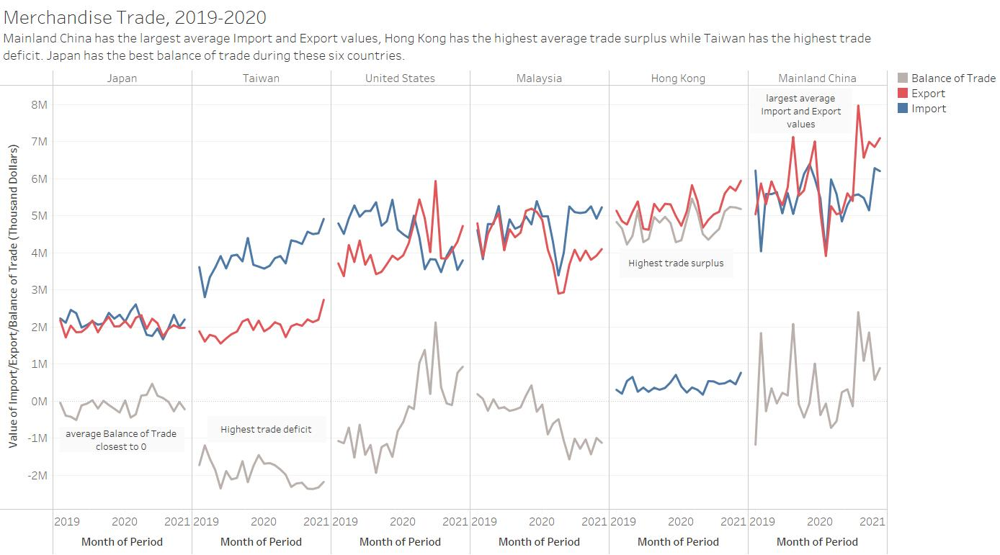

```{r setup, include=FALSE}
knitr::opts_chunk$set(echo = FALSE)
```

# 1.0 Critics

The statistics on merchandise trade are from [Department of Statisitcs Singapore](https://www.singstat.gov.sg/find-data/search-by-theme/trade-and-investment/merchandise-trade/latest-data), 'Merchandise Trade by Region/Market.

We are going to use the data set to get some insights.

## 1.1 Original Visualization

From the dataset we can see that there are import data and export data of hundreds of countries and the original visualization below select six countries to see the detials.


## 1.2 Critics of Clarity

The original visualization has some drawbacks which may mislead readers or convey imformation unclearly.

* The ‘month of period’ of Japan is different from all the other 5 countries, it only has 2020, which is inconsistent with the title.

* There are two Y-axes in every subpicture and the two Y-axes have different scales. This may confuse readers if the pictures are similar but the scales are significantly different. What’s more, the different scale of the Y-axis of all 6 pictures makes it difficult for readers to make the comparison among the 6 countries.

* The Y axis is not accurate. We can see from the raw data that the unit is thousand dollars, but there is no note to explain this. This will mislead readers to treate the actually 4M thousand dollars to be just 4M dollars.

* There is no subtitle and the title only introduces what are the pictures but cannot convey the point the pictures are going to present. No lead-in or called-out to offer the context.

* The title is not accurate. The figure cannot reflect that the six countries are the top six trading countries since from the dataset we can see that the top six countries of import, export, or total are all not consistent with the six countries in the figure.

## 1.3 Critics of Aesthetics

The original visualization has some parts may not that beautiful.

* The area charts are not necessary, it does not convey any information, the overlap area makes is difficult to see clearly.

* The color of import and export is not suitable, the overlap of light blue and light yellow makes the graph looks dirty, not clean.

* The separate of six sub-graph distract readers and will lead readers to treat them separately.


# 2.0 Alternative Graphical Presentation


# 3.0 Tableau Design

[Trade Viz](https://public.tableau.com/app/profile/xiaolan.yin/viz/TradeVizforSixLargeTradingCountries/TradeViz)

# 4.0 Step-by-step Description

Now we comes to the details of creating the new visualization.

# 4.1 Data Preparation

First of all, we download the data 'outputFile.xlsx' from the official website and check all the data we have. It contains three sheets, one is content, one is T1 (import) and another is T2 (export).

We can know that we have the import and export data of hundreds of countries in different time, the total number of countries of import and export are different (import 120 countries, export 92 countries), and the time period starts from Jan 1976, ends in Apr 2021.

1. Get the sheet contains only the data without other information.

Open the excel, copy the T1 sheet, which contains the import data, named the new sheet 'import' and delete the rows contains other information before and after the data.

before:


after:


Do the same steps for export data (T2) and get a new sheet 'export'.

2. Get the statistic of import and export compare with the performance last year, only for 2020.

Make copies of import and export sheet, named 'Im_inter' and 'Ex_inter'. In the 'Im_inter' sheet, select the cells of first row and add a filter. In the 'variables' column select the specific six countries.

Copy the value from Jan 2019 to Dec 2020 and paste below.


In the cell below 2020 Jan, type in the formula 'the year-on-year ratio = (the import value in a specific month in 2020 - the import value of the month in 2019) / the import value of the month in 2019' and drag down and right to get all the percentage of the six countries in 2020.


We copy all the percentage statistics and prepare a new sheet 'Im_yoyr' for further tableau exploration.


Then do the same steps for export part and get a new sheet 'Ex_yoyr'.

## 4.2 Data Visualization

Now we open the tableau and start to create our visualization.

1. Set the data source.

We import the 'outputFile.xlsx' and drag the 'import' to the up right window. Select the columns from '1976 Jan' to 'Apr 2021' by click the first column, press 'shift' and click the last column, right click and select 'pivot'.


Then change the name of the three columns to 'country', 'period' and 'merchandise import'. Click the 'abc' icon above 'period' column and change the data type to date, change the type of 'merchandise import' from 'abc' to 'number(decimal)' using the same way. Now the table looks like this.


Then drag the export to the window and make the same changes. Also, set the relation ship between the import and export. It matches when country in import equals country Ex in export and period equals period Ex, the cardinality is one to one.


Drag the 'Im_yoyr' to the window link to import. select all the columns exclude variables and pivot the table. Do the same changes to column name, column type and the relationship as figure below.


Do the same steps for 'Ex_yoyr' and the result should looks like the figure below.


2. Make a new visualization of the import and export data of the six countries from 2019 to 2020.

First we check the 'Tables' and change the 'merchandise import' and 'merchandise export' from discrete to continuous.


And Drag 'merchandise import' below.


First we drag the 'Country' of 'Import' to 'Filters' and check the six countries (Hong Kong, Japan, Mainland China, Malaysia, Taiwan, US), click OK.


Then we drag 'Periof' of 'Import' to 'Filters' and select '#year' click next and check only 2019, 2020.


We drag 'Country' and 'Period' from 'Import' to columns, click the plus icon to get the 'month' of 'period', and change the 'month' from discrete to continuous. Then we drag 'Quarter' and 'year' out.


We drag 'merchandise import' from 'import' to rows. Then drag 'merchandise export' from 'export' to the Y axis.


Click the triangle above 'Tables' and select 'create calculate field', set the name to 'Balance of Trade' and the formula is 'Balance of Trade = value of Exports - value of Imports'.


Drag the 'Balance of Trade' from 'Measure Names' to the Y axis and change the color of the three lines.


Finally, we do following steps to modify the graph.

Right click columns label area and select hide field labels for columns.


Right click Y axis and change the name of Y axis to 'Value of Import/Export/Balance of Trade (Thousand Dollars)'.


Right click the country name, select edit the X alias for all six countries, delete the space before country name and the note after country name.


Then right click title area and edit the title and subtitle.


Right click the white space in the graph, hang on annotate and select area to add the annotation to the graph.


Right click the legend, select edit title and delete it in the new window. Then right click 'Merchandise Import' and select edit alias to delete 'Merchandise' and remain 'Import'. Do the same for 'Export'.


The final 'Merchandise Trade' is as follow.



3. Create a line chart to show the year-on-year ratio of both import and export values for the six countries.

We drag the 'Period im yoyr' from 'Im_yoyr' to columns, change the level from year to month, and change it from discrete to continuous, remove 'quarter' and 'year'.

Drag the 'Year-on-year Ratio Import' and 'Year-on-year Ratio Export' from 'Im_yoyr' and 'Ex_yoyr' to rows.

Drag the 'Country im yoyr' from 'Im_yoyr' to color.

We can see the draft as figure below.


Then we start modify the graph. We edit the title and subtitle, edit the Y axis title, right click the X axis and select edit axis and delete the title in the newly appeared window.


Then we edit the legend by right click every country label and select edit alias. We keep the country name only.

Finally add some annotates.The final 'Year-on-year Ratio' is as follow.


4. Create a dash board.

We drag the 'Merchandise Trade' and 'Year-on-year Ratio' to the dashboard and adjust them.

Then we check 'show dashboard title' and then edit it.


Right click the dashboard title area and select format title, select two different light gray for the dashboard background and title shading.


The final dashboard snapshot is as follow.


# 5.0 Observations
